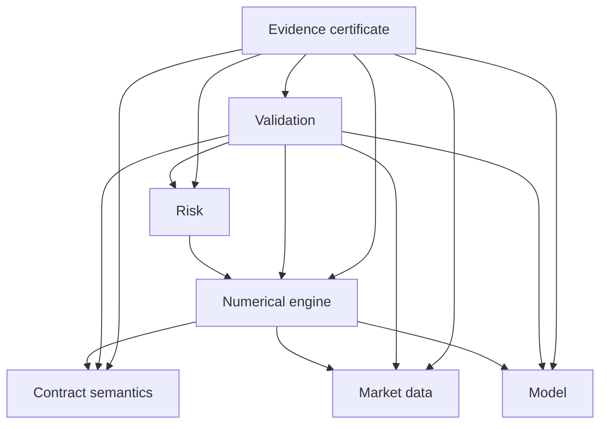
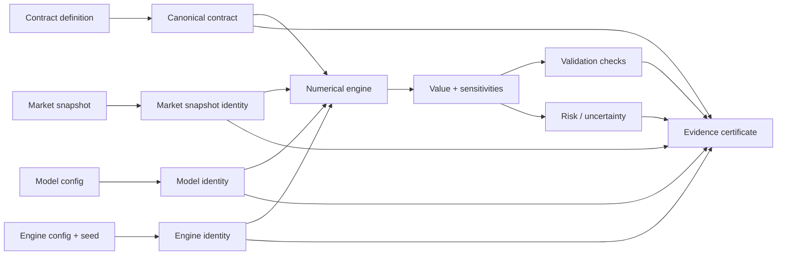

# Architecture

This document describes the architecture of DerivaTrace. Stage 1A implements the
**contract semantics** and **validation** bounded contexts as a concrete, typed
contract algebra (`derivatrace.contracts`); no pricing, valuation, model,
engine, risk, or certificate functionality is implemented in Stage 1A. Stages
1B (canonicalization and a canonical payoff graph) and 1C (serialization and
evidence records) are planned. The Stage 1B architecture baseline is now
Complete; the **Stage 1B-R1 canonical runtime is Implemented** in
`derivatrace.canonical` (byte-exact canonicalization and canonical contract
identity), while the **Stage 1B-R2 payoff-graph runtime remains Planned** (its specification is
now closed). The specification is in
[canonicalization-spec.md](./canonicalization-spec.md),
[payoff-graph-spec.md](./payoff-graph-spec.md),
[canonical-test-vectors.md](./canonical-test-vectors.md), and
[ADR 0007](./adr/0007-canonical-contract-identity-and-payoff-graph.md).

## Architectural principle

> **A valuation without evidence is an incomplete output.**

## Bounded contexts

DerivaTrace is organized around seven bounded concerns. Each has a single,
clear responsibility and must not silently absorb another's duty.

1. **Contract semantics** — defines what an instrument pays. In Stage 1A this is
   the implemented `derivatrace.contracts` module: an immutable, typed contract
   AST with exact numbers, explicit units, observable identity, and separated
   observation/settlement times.
2. **Market data** — captures observable inputs and snapshots.
3. **Model** — declares stochastic assumptions.
4. **Numerical engine** — performs calculations using a method.
5. **Risk** — computes sensitivities and uncertainty.
6. **Validation** — checks invariants and arbitrage conditions. In Stage 1A this
   is the implemented `validate_contract` whole-graph validator (structural and
   semantic checks; no economic/arbitrage pricing checks, which remain planned).
7. **Evidence certificate** — records what was calculated and how.

## Dependency direction

Dependencies point from the consumer of evidence toward the deterministic core,
never the reverse. Higher layers depend on the explicit outputs of lower layers;
the contract semantics layer has no dependency on any model or engine.

## Data-flow diagram

A future valuation flow is designed to be explicit and auditable end to end.

## Deterministic core boundaries

The deterministic core is authoritative for:

- contract semantics and canonicalization,
- calculations,
- tolerances,
- validation,
- certificate assembly and hashing.

The core must remain pure, typed, and free of hidden state. External assistive
features (for example, natural-language summaries) operate *around* the core and
must not mutate its inputs or outputs.

### Canonicalization and reachable-node pruning

The Stage 1B-R1 canonical runtime (`derivatrace.canonical`) produces a canonical
contract document containing **only nodes reachable from the canonical root**.
After associative flattening, literal folding, and conditional branch selection,
intermediate nodes (flattened-away collection operators, folded-away literals,
discarded branches) are **pruned before serialization**. The public
`CanonicalContract.node_count` reports the number of reachable nodes only.
Canonical bytes represent the reachable normalized graph; internal processing
history is never part of canonical identity. Reachability is determined by an
explicit per-node-type reference-field schema (§7 of `canonicalization-spec.md`);
no heuristic string matching is used.

## Plugin boundaries (planned for later)

Future extensions (models, engines, formats) are planned to be registered
explicitly and to operate through fixed interfaces. A plugin may add behaviour
but must not silently override the deterministic core, alter validation
outcomes, or change contract semantics. Plugin metadata is treated as untrusted.

## Trust boundaries

- **Inside the deterministic core:** trusted, deterministic, tested code.
- **External inputs:** contracts, market snapshots, serialized certificates,
  plugin metadata, and contribution inputs are untrusted.
- **Assistive/AI features:** untrusted to change authoritative results.
- **Signing/verification (future):** a boundary separating integrity hashes
  from external cryptographic signatures.

## Error-taxonomy strategy

Errors are categorized to keep failure modes explicit:

- **Input errors** — malformed, ambiguous, or unsupported contract/market input.
- **Validation errors** — invariant or arbitrage checks failed.
- **Numerical errors** — non-finite values, non-convergence, tolerance breach.
- **Reproducibility errors** — mismatch between declared and observed config.
- **Integrity errors** — certificate hash mismatch or tamper detection.
- **Security errors** — untrusted input attempting unsafe behaviour.

## Versioning strategy

- **Package version** follows semantic versioning once published (currently
  `0.1.0.dev0`).
- **Schema versions** are explicit for contracts, market snapshots, and
  certificates, enabling migration without ambiguity.
- **ADRs** capture constitutional decisions and their evolution.

## Testing strategy

- Strict typing with `mypy --strict`.
- Linting and formatting with `ruff`.
- Unit tests with `pytest` and branch coverage; Stage 0 package target is 100%.
- CI matrix on Python 3.11, 3.12, 3.13, and 3.14.
- Documentation-link and content checks as tests.

## Performance strategy

Stage 0 has no hot paths. Future numerical engines are planned to expose seeds,
path counts, time steps, sampling methods, error estimates, and convergence
diagnostics so that performance and accuracy are measurable and reproducible.

## Extension strategy

Extensions are added through explicit interfaces and registered metadata. The
separation of concerns and the no-hidden-intelligence rule are enforced by
design review and tests, not by the extensions themselves.

## Forbidden dependencies between layers

The following dependencies are explicitly forbidden:

- A contract definition must **not** depend on a model or numerical engine.
- A model must **not** silently select or configure a numerical engine.
- A numerical engine must **not** alter contract semantics or validation rules.
- Validation must **not** modify the value it checks.
- The certificate layer must **not** compute prices or choose models.
- Assistive tooling must **not** change contracts, inputs, engine settings, or
  validation outcomes.
- No layer may absorb another layer's responsibility silently.

See also [contract-semantics.md](./contract-semantics.md),
[contract-api.md](./contract-api.md),
[certificate-spec.md](./certificate-spec.md),
[ADR 0006](./adr/0006-stage-1-contract-algebra-and-runtime-type-system.md),
and the other ADRs under [./adr/](./adr/).
